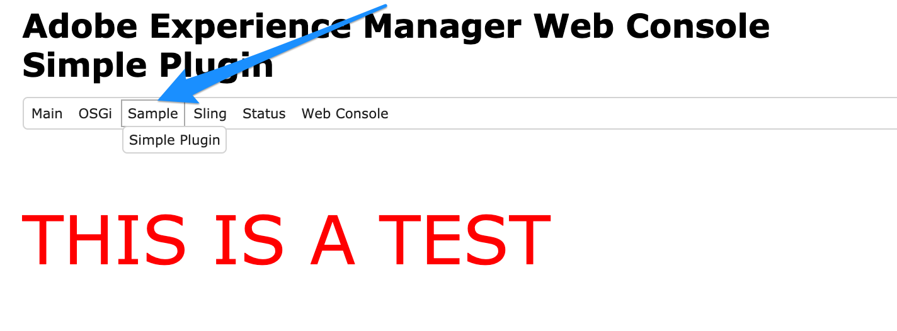

# Sample OSGI Web Console Plugin

This gives you an initial skeleton to build an Felix Web Console Plugin. For AEM or any other felix-based application.



> Used [felix-search-webconsole-plugin](https://github.com/neva-dev/felix-search-webconsole-plugin) and trimmed it down to this basic sample.

> This is built with OSGI R6 annotations. If you'd like aversion that uses a bundle activator instead, ues [this branch](https://github.com/ahmed-musallam/felix-sample-webconsole-plugin/tree/any-osgi-version)

## Build
Must have a felix (or AEM) instance running on port 4502.
Clone and run:

```
mvn clean install -PautoInstallBundle
```
